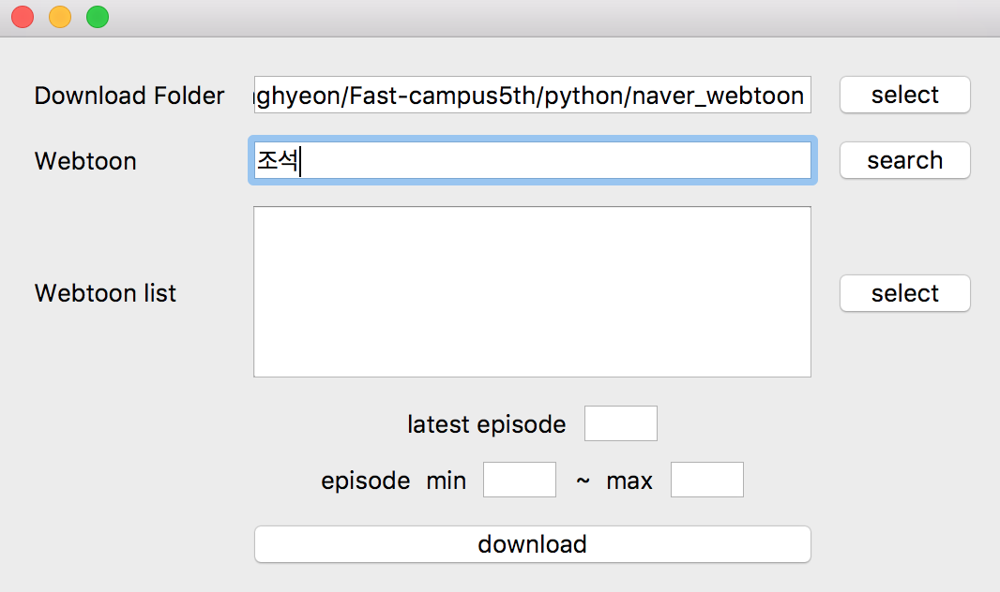

# Webtooncrawler

### 1. 메인화면

#### 1. Download Folder
[ 그림 1-1 ]

[ 그림 1-2 ]

- select 버튼을 누르면 그림 1-1 뜹니다.
- 경로를 누르고 open 버튼을 클릭하면 Download Folder의 text input 창에 경로가 뜹니다. 그림 2-2

#### 2. Webtoon

[ 그림 2-1 ]

- Webtoon text input창에 검색어를 입력합니다. [ 그림 2-1 ]
- search 버튼을 클릭하면 [ 그림 3-1 ]에 검색목록이 뜹니다.

#### 3. Webtoon List

[ 그림 3-1 ]

- 웹툰을 선택한 후 select 버튼을 클릭하면 latest episode에 선택한 웹툰의 최신화가 몇 화인지 표시됩니다. [ 그림 4-1 ]

#### 4. latest episode, episode min ~ max

[ 그림 4-1 ]

[ 그림 4-2 ]

- 다운로드 할 웹툰을 선택하고 범위를 episode min [1] ~ max [2] 1번 2번에 지정합니다.

#### 5. downloaw
[ 그림 5-1 ]

[ 그림 5-2 ]

- download 버튼을 누르면 선택한 폴더에 웹툰을 다운 받습니다.
- download 완료되면 알람이 나타납니다.
- 다운로드 할때는 멀티프로세싱을 써서 에피소드를 하나하나 다운 받는 것이 아니라 한 번에 1화~5화를 다운 받을 수 있게 설정했습니다. 제 생각에는 그러면 속도가 상당히 증가하리라 생각 했는데 2초 정도가 차이 났습니다.

